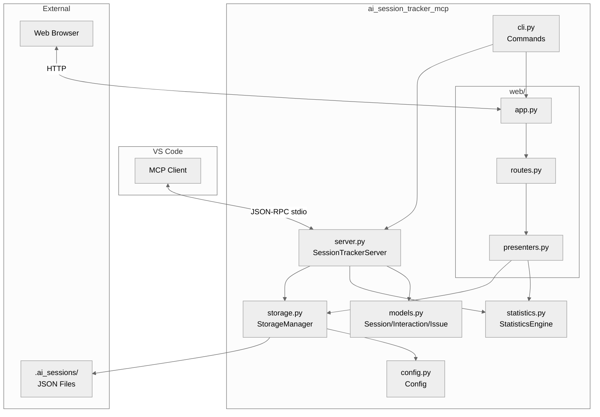
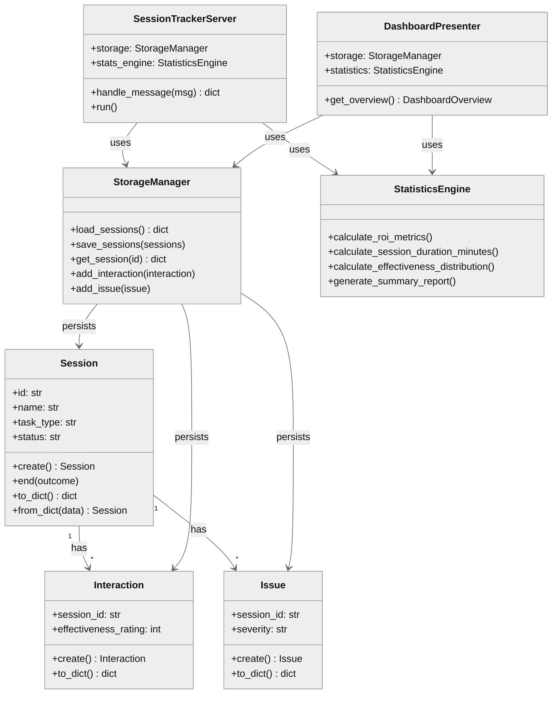
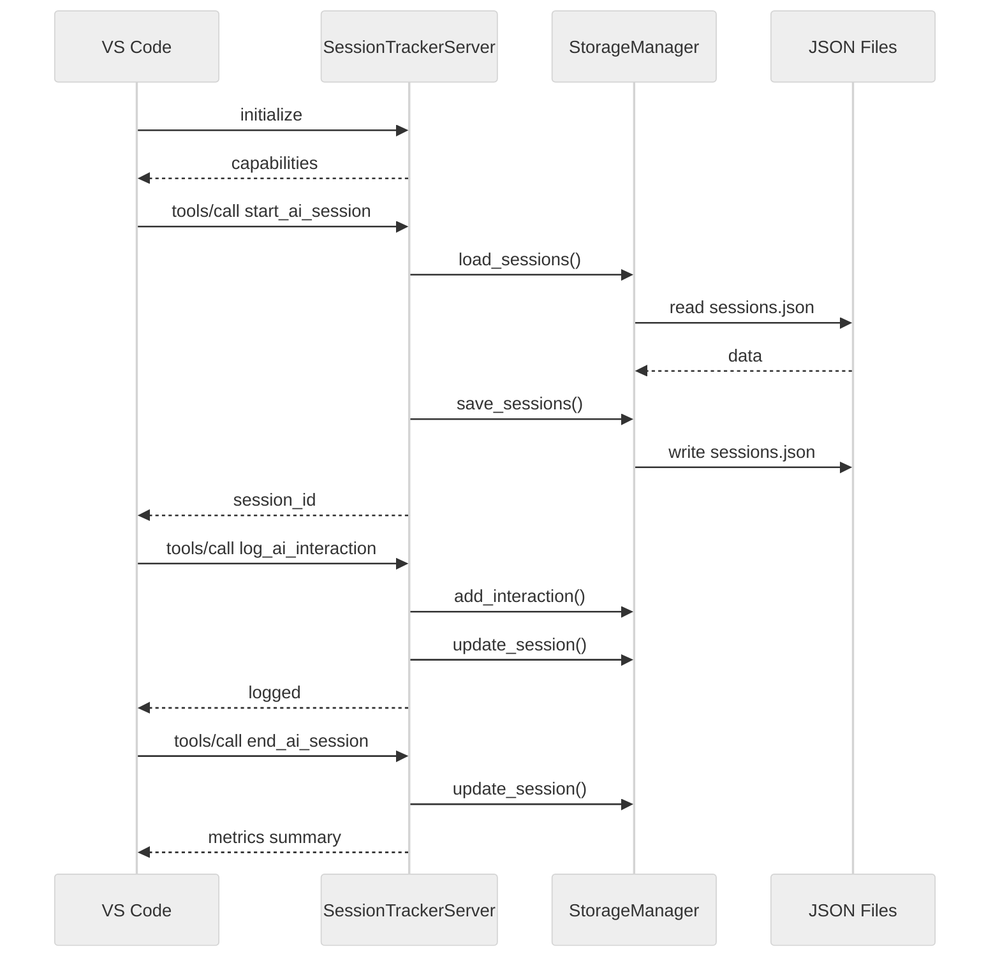

# ai_session_tracker_mcp

## 1. Component Overview

| Attribute | Value |
|-----------|-------|
| **Name** | ai_session_tracker_mcp |
| **Type** | Package (MCP Server + Web Dashboard) |
| **Responsibility** | Track AI coding sessions, measure productivity, calculate ROI |
| **Language** | Python 3.13+ |
| **Runtime** | asyncio (MCP), uvicorn/FastAPI (web) |
| **Stack** | MCP Protocol, FastAPI, htmx, matplotlib, JSON storage |
| **State** | Stateful (JSON files in `.ai_sessions/`) |

**Boundaries:**
- **Context**: VS Code MCP integration, standalone CLI
- **Public Surface**: MCP tools, CLI commands, REST API, web dashboard

**Architecture Patterns:**
- Presenter Pattern (UI logic separation)
- Dependency Injection (FileSystem, Storage, Statistics)
- Protocol-based interfaces (FileSystem)
- Factory methods (Model creation)

**Key Decisions:**
- JSON file storage (simplicity over database)
- Server-side chart rendering (matplotlib)
- htmx for dashboard (minimal JS)

**Risks:** Single-writer assumed, no concurrent write protection

---

## 2. Code Layout

```
ai_session_tracker_mcp/
├── __init__.py         # Package exports, docstring overview
├── __main__.py         # python -m entry point → cli.main()
├── __version__.py      # Version metadata (0.1.0)
├── cli.py              # CLI: server, dashboard, report, install commands
├── config.py           # Config dataclass: rates, paths, task types
├── filesystem.py       # FileSystem Protocol + RealFileSystem impl
├── models.py           # Domain: Session, Interaction, Issue, FunctionMetrics
├── presenters.py       # ViewModels + DashboardPresenter + ChartPresenter
├── server.py           # MCP server: SessionTrackerServer + tool handlers
├── statistics.py       # StatisticsEngine: ROI, effectiveness, gaps
├── storage.py          # StorageManager: JSON I/O, CRUD operations
├── agent_files/
│   ├── agents/         # VS Code custom agent definitions
│   └── instructions/   # AI instruction files for agents
└── web/
    ├── __init__.py     # Exports: create_app, run_dashboard
    ├── app.py          # FastAPI factory + uvicorn runner
    └── routes.py       # Routes: HTML, partials, charts, API
```

---

## 3. Public Surface

### 🔒 MCP Tools (ABI-frozen)

| Tool | Signature | Stability |
|------|-----------|-----------|
| `start_ai_session` | `(session_name, task_type, model_name, human_time_estimate_minutes, estimate_source, context?) → session_id` | 🔒 frozen |
| `log_ai_interaction` | `(session_id, prompt, response_summary, effectiveness_rating, iteration_count?, tools_used?) → void` | 🔒 frozen |
| `end_ai_session` | `(session_id, outcome, notes?) → void` | 🔒 frozen |
| `flag_ai_issue` | `(session_id, issue_type, description, severity) → void` | 🔒 frozen |
| `log_code_metrics` | `(session_id, file_path, functions_modified[]) → metrics` | 🔒 frozen |
| `get_ai_observability` | `(session_id?, time_range?) → report` | 🔒 frozen |
| `get_active_sessions` | `() → active_sessions[]` | 🔒 frozen |

### 🔒 CLI Commands (ABI-frozen)

```bash
ai-session-tracker server [--dashboard-host HOST] [--dashboard-port PORT]
ai-session-tracker dashboard [--host HOST] [--port PORT]
ai-session-tracker report
ai-session-tracker install
```

### 🔒 Core Classes

| Class | Key Methods | Stability |
|-------|-------------|-----------|
| `Session` | `.create()`, `.end()`, `.to_dict()`, `.from_dict()` | 🔒 frozen |
| `Interaction` | `.create()`, `.to_dict()`, `.from_dict()` | 🔒 frozen |
| `Issue` | `.create()`, `.to_dict()`, `.from_dict()` | 🔒 frozen |
| `FunctionMetrics` | `.effort_score()`, `.to_dict()`, `.from_dict()` | 🔒 frozen |
| `Config` | `.ai_hourly_rate()`, `.roi_multiplier()`, `.filter_productive_sessions()` | 🔒 frozen |
| `StorageManager` | `.load_sessions()`, `.save_sessions()`, `.get_session()`, `.update_session()`, `.load_interactions()`, `.add_interaction()`, `.load_issues()`, `.add_issue()` | 🔒 frozen |
| `StatisticsEngine` | `.calculate_roi_metrics()`, `.calculate_session_duration_minutes()`, `.calculate_effectiveness_distribution()`, `.calculate_session_gaps()`, `.generate_summary_report()` | 🔒 frozen |
| `SessionTrackerServer` | `.handle_message()`, `.run()` | 🔒 frozen |

### ⚠️ Internal Classes

| Class | Purpose | Stability |
|-------|---------|-----------|
| `DashboardPresenter` | Transform storage → view models | ⚠️ internal |
| `ChartPresenter` | Render matplotlib charts | ⚠️ internal |
| `*ViewModel` dataclasses | UI display models | ⚠️ internal |
| `RealFileSystem` | Production filesystem impl | ⚠️ internal |

### Data Contracts

**Session JSON:**
```json
{
  "id": "string", "session_name": "string", "task_type": "string",
  "status": "active|completed", "start_time": "ISO8601", "end_time": "ISO8601?",
  "model_name": "string", "human_time_estimate_minutes": "float",
  "estimate_source": "manual|issue_tracker|historical",
  "outcome": "success|partial|failed?", "notes": "string",
  "total_interactions": "int", "avg_effectiveness": "float",
  "code_metrics": [...]
}
```

**Interaction JSON:**
```json
{
  "session_id": "string", "timestamp": "ISO8601", "prompt": "string",
  "response_summary": "string", "effectiveness_rating": "1-5",
  "iteration_count": "int", "tools_used": ["string"]
}
```

**Issue JSON:**
```json
{
  "session_id": "string", "timestamp": "ISO8601", "issue_type": "string",
  "description": "string", "severity": "low|medium|high|critical",
  "resolved": "bool", "resolution_notes": "string"
}
```

---

## 4. Dependencies

### Depends On
| Dependency | Purpose |
|------------|---------|
| fastapi | Web dashboard framework |
| uvicorn | ASGI server |
| jinja2 | Template engine |
| matplotlib | Chart rendering |

### Required By
| Consumer | Integration |
|----------|-------------|
| VS Code | MCP stdio protocol |
| External tools | REST API `/api/*` |

### IO Interfaces
| Interface | Protocol | Direction |
|-----------|----------|-----------|
| MCP | JSON-RPC 2.0 over stdio | Bidirectional |
| HTTP | REST + HTML | Inbound |
| Filesystem | JSON files | Read/Write |

---

## 5. Invariants & Errors

### ⚠️ Invariants (MUST PRESERVE)

| Invariant | Location | Threshold |
|-----------|----------|-----------|
| Session IDs unique | `models._generate_session_id()` | timestamp-based |
| Effectiveness rating 1-5 | `Interaction.create()` | clamped |
| Task types from enum | `Config.TASK_TYPES` | frozenset |
| Severity levels from enum | `Config.SEVERITY_LEVELS` | frozenset |
| JSON files always valid | `StorageManager._read_json()` | returns default on error |

### Verification

```bash
pdm run test           # Unit tests
pdm run test-cov       # With coverage (≥80% required)
pdm run lint           # Ruff linting
pdm run typecheck      # MyPy strict mode
pdm run check-all      # All checks
```

### Constraints

| Type | Constraint |
|------|------------|
| **Performance** | Single-threaded, synchronous file I/O |
| **Security** | Local storage only, no auth on web dashboard |
| **Concurrency** | NOT thread-safe, single writer assumed |

### Side Effects

| Operation | Side Effect |
|-----------|-------------|
| `start_ai_session` | Creates/updates `sessions.json` |
| `log_ai_interaction` | Appends to `interactions.json`, updates session |
| `flag_ai_issue` | Appends to `issues.json` |
| `log_code_metrics` | Updates session with metrics |
| `run_install` | Creates `.vscode/mcp.json`, copies agent files |
| `run_dashboard` | Binds network port |

### Error Types

| Error | When Raised |
|-------|-------------|
| JSON-RPC `-32602` | Missing/invalid params |
| JSON-RPC `-32601` | Unknown tool/method |
| JSON-RPC `-32603` | Internal error |
| JSON-RPC `-32700` | Parse error |
| `OSError` | Storage dir inaccessible (logged, not raised) |

---

## 6. Usage

### Quick Start

```bash
# Install
pip install ai-session-tracker-mcp

# Install into project
cd your-project
ai-session-tracker install

# Run MCP server (VS Code handles this via mcp.json)
ai-session-tracker server

# Launch web dashboard
ai-session-tracker dashboard --port 8000

# Print text report
ai-session-tracker report
```

### Configuration

| ENV Variable | Purpose | Default |
|--------------|---------|---------|
| `AI_OUTPUT_DIR` | Redirect session data to a custom directory | `.ai_sessions` |
| `AI_MAX_SESSION_DURATION_HOURS` | Cap session duration for auto-close | `4.0` |

**`AI_OUTPUT_DIR` — Centralized Aggregation**

Set `AI_OUTPUT_DIR` to redirect all session data away from the local `.ai_sessions`
directory. Useful for team or cross-project aggregation:

```bash
# Shared network drive
export AI_OUTPUT_DIR=/mnt/team-share/jsmith/ai-sessions

# Cloud-synced folder (OneDrive, Dropbox, etc.)
export AI_OUTPUT_DIR=/home/jsmith/OneDrive/ai-metrics/my-project

# Local git repo (commit and push on your own schedule)
export AI_OUTPUT_DIR=/home/jsmith/team-metrics/jsmith/my-project
```

The MCP server writes `sessions.json`, `interactions.json`, and `issues.json` to
whatever path is configured. How data gets to a central location is up to you —
see the [Backup and Sync Guide](../../docs/backup-sync-guide.md) for patterns
covering cloud sync, network shares, git, S3, and rsync on both Linux and Windows.

**Cost Config (in `config.py`):**
- `HUMAN_HOURLY_RATE`: $130/hr
- `AI_MONTHLY_COST`: $40/mo
- `WORKING_HOURS_PER_MONTH`: 160

### Testing

```bash
# Run all tests
pdm run test

# With coverage report
pdm run test-cov

# Single test file
pdm run pytest tests/test_server.py -v
```

### Common Pitfalls

| Issue | Fix |
|-------|-----|
| Session ID lost | Use `get_active_sessions` tool |
| matplotlib ImportError | Charts show SVG placeholder |
| Port in use | Change `--port` or kill existing process |
| JSON corruption | StorageManager creates backup, returns empty |

---

## 7. AI-Accessibility Map

| Task | Target | Guards | Change Impact |
|------|--------|--------|---------------|
| Add MCP tool | `server.py:_build_tool_definitions()`, `_tool_handlers` | Add handler + schema | API expansion |
| Modify session fields | `models.py:Session`, `storage.py` | Update to_dict/from_dict | Storage migration |
| Add CLI command | `cli.py:main()`, add subparser + handler | Arg parsing | CLI surface |
| Add dashboard panel | `routes.py`, `presenters.py` | Add route + presenter method | Web UI |
| Change cost params | `config.py:Config` | Update ClassVar | ROI calculation |
| Add issue severity | `config.py:SEVERITY_LEVELS`, `models.py:Issue` | Update frozenset | Enum expansion |
| Modify statistics | `statistics.py:StatisticsEngine` | Pure functions | Calculation logic |
| Add chart type | `presenters.py:ChartPresenter`, `routes.py` | Add render + route | Visualization |

---

## 8. Architecture Diagrams

### System Boundaries



### Class Relationships



### MCP Message Flow


