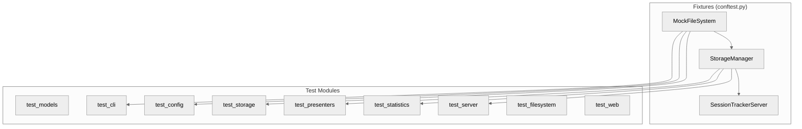
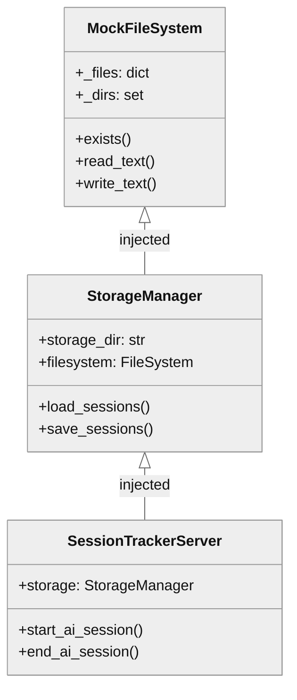

# tests/ — Test Suite

> AI-readable architectural contract for the test suite.

---

## 1. Component Overview

| Attribute | Value |
|-----------|-------|
| **Name** | tests |
| **Type** | test-suite |
| **Responsibility** | Unit/integration tests for ai_session_tracker_mcp |
| **Language** | Python 3.13 |
| **Framework** | pytest + pytest-asyncio |
| **Coverage Target** | ≥80% (enforced in pyproject.toml) |

### Boundaries
- **Context**: Isolated test environment using MockFileSystem
- **Public Surface**: Fixtures (`mock_fs`), MockFileSystem class

### Patterns
- **Mock Injection**: All I/O uses MockFileSystem (no real disk)
- **Fixture Composition**: `mock_fs` → `storage` → `server`
- **Test Class Organization**: One class per behavior category
- **Docstring Convention**: Business context + Arrangement/Action/Assertion

### State
- **Stateless**: Each test gets fresh fixtures
- **Isolation**: MockFileSystem prevents cross-test contamination

---

## 2. Code Layout

```
tests/
├── __init__.py           # Package marker
├── conftest.py           # MockFileSystem + shared fixtures (558 LOC)
├── test_cli.py           # CLI command tests (951 LOC)
├── test_config.py        # Config loading/validation (700 LOC)
├── test_filesystem.py    # RealFileSystem adapter (945 LOC)
├── test_main.py          # Entry point tests (104 LOC)
├── test_models.py        # Domain models (1834 LOC)
├── test_presenters.py    # Dashboard/Chart presenters (1510 LOC)
├── test_server.py        # MCP tool handlers (2291 LOC)
├── test_statistics.py    # Analytics engine (1553 LOC)
├── test_storage.py       # Persistence layer (1134 LOC)
└── test_web.py           # FastAPI routes (1021 LOC)
```

**Total**: 12,602 LOC, 418 tests

---

## 3. Public Surface

### MockFileSystem 🔒frozen

In-memory filesystem for testing without actual I/O.

```python
class MockFileSystem:
    def exists(path: str) -> bool
    def is_file(path: str) -> bool
    def is_dir(path: str) -> bool
    def makedirs(path: str, exist_ok: bool = False) -> None
    def read_text(path: str, encoding: str = "utf-8") -> str
    def write_text(path: str, content: str, encoding: str = "utf-8") -> None
    def chmod(path: str, mode: int) -> None
    def remove(path: str) -> None
    def iterdir(path: str) -> list[str]
    def copy_file(src: str, dst: str) -> None
    def rename(src: str, dst: str) -> None
    # Test helpers
    def get_file(path: str) -> str | None
    def set_file(path: str, content: str) -> None
    def list_files() -> list[str]
    def list_dirs() -> list[str]
    def clear() -> None
```

**Change Impact**: Breaks all tests using mock I/O

### Fixtures ⚠️internal

| Fixture | Scope | Provides |
|---------|-------|----------|
| `mock_fs` | function | Fresh MockFileSystem |
| `storage` | function | StorageManager(mock_fs) |
| `server` | function | SessionTrackerServer(storage) |

---

## 4. Dependencies

### Depends On
| Dependency | Purpose |
|------------|---------|
| pytest | Test framework |
| pytest-asyncio | Async test support |
| pytest-cov | Coverage reporting |
| ai_session_tracker_mcp.* | Code under test |

### IO Interfaces
| Interface | Mock |
|-----------|------|
| Filesystem | MockFileSystem (no real I/O) |
| HTTP | TestClient (FastAPI) |

---

## 5. Invariants & Errors

### ⚠️ Invariants (MUST PRESERVE)

| Invariant | Enforcement |
|-----------|-------------|
| No real filesystem I/O | MockFileSystem injection |
| Test isolation | Fresh fixtures per test |
| Coverage ≥80% | pyproject.toml fail_under |
| All tests pass | CI gate |

### Verification Commands

```bash
# Run all tests
pdm run test

# Run with coverage
pdm run test-cov

# Run specific file
pdm run pytest tests/test_server.py -v

# Run specific test
pdm run pytest tests/test_server.py::TestServerInit -v
```

### Side Effects

| Operation | Side Effect | Mitigation |
|-----------|-------------|------------|
| Coverage | .coverage file | .gitignore |

**Filesystem Usage**:
- **Most tests**: Use MockFileSystem — no real disk I/O
- **test_server.py**: Uses `tempfile.mkstemp` for AST parsing tests (Python files must exist for `ast.parse`)

---

## 6. Usage

### Running Tests

```bash
# All tests with verbose output
pdm run test

# With coverage report
pdm run test-cov

# Single module
pdm run pytest tests/test_models.py -v

# Match pattern
pdm run pytest -k "test_session" -v
```

### Writing New Tests

```python
# tests/test_example.py
from conftest import MockFileSystem

class TestFeature:
    """Tests for feature X."""

    def test_behavior(self, mock_fs: MockFileSystem) -> None:
        """Verifies behavior description.

        Business context:
        Why this matters to users.

        Arrangement:
        Setup steps.

        Action:
        What is being tested.

        Assertion Strategy:
        What is validated and why.
        """
        # Arrange
        mock_fs.set_file("/path", "content")

        # Act
        result = function_under_test()

        # Assert
        assert result == expected
```

### Pitfalls

| Pitfall | Fix |
|---------|-----|
| Forgetting async | Use `async def test_*` + pytest-asyncio |
| Real I/O in tests | Always inject MockFileSystem |
| Fixture not found | Import from conftest or add to conftest.py |

---

## 7. AI-Accessibility Map

| Task | Target | Guards | Change Impact |
|------|--------|--------|---------------|
| Add test for new feature | `test_<module>.py` | Follow docstring convention | None if isolated |
| Modify MockFileSystem | `conftest.py` | Must match FileSystem Protocol | All tests using mock |
| Add shared fixture | `conftest.py` | Scope appropriately | Tests using fixture |
| Change coverage threshold | `pyproject.toml` | ≥80% minimum | CI failures if lowered |

---

## 8. Test Coverage by Module

| Module | Test File | Tests | Coverage |
|--------|-----------|-------|----------|
| models.py | test_models.py | ~50 | Session, Interaction, Issue, FunctionMetrics |
| storage.py | test_storage.py | ~30 | CRUD, file handling, error recovery |
| server.py | test_server.py | ~60 | All 7 MCP tools |
| statistics.py | test_statistics.py | ~40 | Analytics calculations |
| config.py | test_config.py | ~20 | Load, validate, defaults |
| presenters.py | test_presenters.py | ~40 | Dashboard, charts |
| cli.py | test_cli.py | ~25 | Commands: server, dashboard, report, install |
| filesystem.py | test_filesystem.py | ~25 | RealFileSystem adapter |
| web/*.py | test_web.py | ~30 | FastAPI routes |
| __main__.py | test_main.py | ~5 | Entry point |

---

## 9. Mermaid Diagrams

### Test Architecture



### Fixture Dependency Chain


